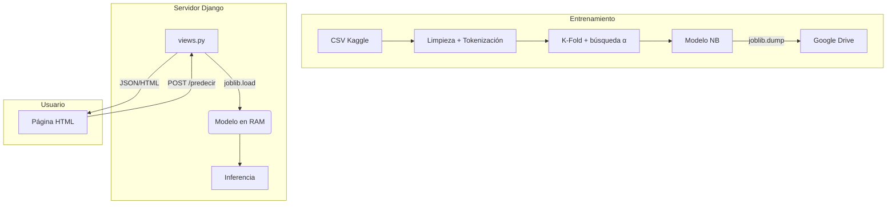

# PROYECTO-DE-INTELIGENICA-ARTIFICIAL
# Sentiment140 – Naïve Bayes desde cero

*Entrenamiento Colab · Modelo *`joblib`* · Interfaz web Django*

---

## Índice

1. [Descripción general](#descripción-general)
2. [Arquitectura de la solución](#arquitectura-de-la-solución)
3. [Instalación y configuración](#instalación-y-configuración)
4. [Instrucciones de uso](#instrucciones-de-uso)
5. [Estructura de archivos](#estructura-de-archivos)
6. [Tecnologías empleadas](#tecnologías-empleadas)
7. [Capturas de pantalla](#capturas-de-pantalla)
8. [Créditos](#créditos)

---

## Descripción general

Proyecto académico que **clasifica tuits en positivo o negativo** usando un **Naïve Bayes Multinomial implementado desde cero**. El flujo cubre:

1. **Entrenamiento** en Google Colab (descarga, limpieza, K‑Fold).
2. **Persistencia** del modelo (`joblib`) en Google Drive.
3. **Backend Django** que carga el modelo y ofrece `/predecir/`.
4. **Frontend HTML/CSS/JS** para introducir texto y ver la predicción.


---

## Arquitectura de la solución



## Instalación y configuración

### Requisitos
- Python 3.10 o superior
- pip / venv (o conda)
- Cuenta Google (Drive + Colab)
- API Kaggle (token kaggle.json)

### Pasos rápidos

```bash
git clone https://github.com/tu‑usuario/tu‑repo.git
cd tu‑repo
python -m venv .venv && source .venv/bin/activate  # Windows: .venv\Scripts\activate
pip install -r requirements.txt
```

## Instrucciones de uso

### 1. Entrenamiento en Google Colab

- Abre `analisis.ipynb` en Colab.
- Ejecuta todas las celdas:
  - Monta Drive, descarga dataset, valida el modelo.
  - El mejor modelo se guarda en `PROYECTO IA/modelo_entrenado.joblib` dentro de tu Drive.
- Copia ese archivo a la raíz del proyecto local.

### 2. Servidor Django

```bash
python manage.py migrate  # primera vez
python manage.py runserver
```

Visita http://127.0.0.1:8000/, escribe un texto y pulsa Analizar.

## Estructura de archivos

```bash
.
├── analisis.ipynb              # Cuaderno de entrenamiento
├── modelo_entrenado.joblib     # Modelo final NB
├── naivebayes.py               # Algoritmo desde cero
├── proyecto_ia/                # Config Django
│   ├── settings.py
│   ├── urls.py
│   └── wsgi.py
├── sentiment_app/              # App Django
│   ├── views.py
│   ├── urls.py
│   └── templates/sentiment_app/index.html
├── FOTOSREADME/                # Capturas usadas en este README
└── README.md
```

## Tecnologías empleadas

| Categoría | Herramienta | Uso |
|-----------|-------------|-----|
| IA | Python puro | Naïve Bayes Multinomial |
| | pandas, numpy | ETL y métricas |
| Persistencia | joblib | Serializar modelo |
| Backend | Django 5.2 | Enrutado, vistas WSGI |
| Frontend | HTML + CSS + JS | Interfaz usuario |
| Infra | Google Colab + Drive | Entrenamiento y almacenamiento |
| Docs | Plant‑UML, Mermaid | Diagramas |

## Capturas de pantalla

| Nº | Archivo | Descripción |
|----|---------|-------------|
| 1 | (FOTOSREADME/overview.png) | Diagrama general |
| 2 | (FOTOSREADME/KFOLDYMATRIZ.png) | Resultados K‑Fold y Matriz de Confusion en Colab |
| 3 | (FOTOSREADME/foto1.png) | Terminal con runserver |
| 4 | (FOTOSREADME/POSITIVE) | Interfaz web con resultado Positivo|
| 5 | (FOTOSREADME/NEGATIVE) | Interfaz web con resultado Negativo|

## Créditos

- Autores: JULIO ANTHONY ENGELS RUIZ COTO , CARNET No. 1284719, CESAR ADRIAN SILVA PEREZ , CARNET No. 1184519, EDDIE ALEJANDRO GIRON CARRANZA, CARNET No. 1307419
- Dataset: Sentiment140 © Go, Hu, Kamath (Kaggle)
- Licencia: MIT
